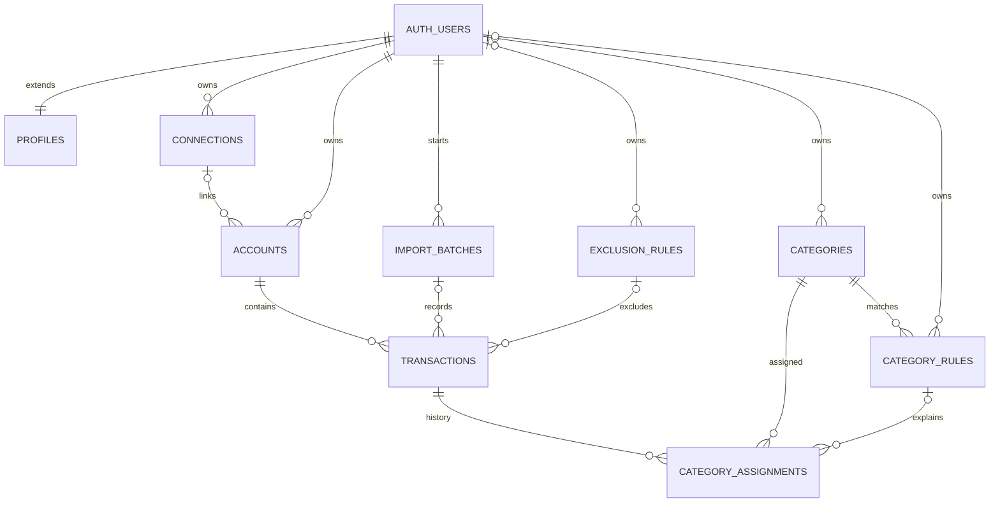

# Fintech ERM

Migration 008 added these tables for a file importer. The importer was removed
on 4 October 2026: bank data reaches the database only through the Tink sync.
The tables stay because they are deployed on the hosted database; the
import-specific parts (`import_batches`, the source and payload columns on
`accounts` and `transactions`) are currently unused.

## Entity Relationship



`CONNECTIONS` is the established table name for provider connections. It now
has a provider key, optional institution identifiers/name, metadata, and
provider-scoped uniqueness. Existing Tink rows keep the default `tink` value
and the one-Tink-connection-per-user behavior. Imported file accounts can
have a null `connection_id` because no bank/provider connection is implied by
the export.

## Tables and Keys

| Table | Responsibility and key ownership |
|---|---|
| `profiles` | Minimal one-to-one extension of `auth.users`; `id` is both PK and FK. Only timestamps are stored until a user-data export defines profile fields. |
| `connections` | Provider connection, owned by `user_id`; `(user_id, provider)` is unique. Institution fields are nullable until source metadata is available. |
| `accounts` | Existing internal UUID PK, owned by `user_id`; optional connection FK; `(user_id, source, source_account_id)` resolves imported accounts. Name/type may be null when the source does not provide them. |
| `import_batches` | User-owned import audit, keyed by UUID; `(user_id, source, checksum)` makes a source-file retry reuse the batch. Stores only the basename and SHA-256, never file contents. |
| `transactions` | Existing internal UUID PK and account FK; adds exact `amount_exact`, source IDs, descriptions, type/mutability, import link, timestamps, exclusion state, and private `raw_payload`. |
| `categories` | System categories have null `user_id`; custom categories reference `auth.users`. Names are case-insensitively unique within each ownership scope. |
| `category_rules` | One keyword per rule, with category FK, fields, match method, priority, and active timestamps. System rows have null owner; custom rows are user-owned. |
| `category_assignments` | Append-only manual/automatic/system assignment history. A partial unique index allows one active primary assignment per transaction. |
| `exclusion_rules` | Separate system or user-owned description exclusions, including fields, method, reason, and active timestamps. |

Foreign keys cascade when an auth user/account is deleted, set optional batch,
rule, or exclusion references to null when their audit parent is removed, and
restrict category deletion while assignments reference it. Composite
`(transaction_id, user_id)` ownership prevents assignments from crossing users.

`transactions.amount` is integer cents; the application and the Tink sync
read and write it. `amount_exact NUMERIC` was backfilled from those cents for
existing rows, and a trigger fills it from the cents whenever an insert leaves
it out (`..._record_live_changes.sql`). No floating-point value is involved.

Tink's provider transaction IDs are intentionally not unique: Demo Bank
renumbers them, so the sync recognises a transaction by its content
(`supabase/functions/_shared/tink/reconcile.ts`).

## Ownership and RLS

`auth.users.id` is the root owner. A database trigger creates `profiles` for
new auth users, and existing auth users are backfilled by the migration.
Accounts and transactions retain the existing direct `user_id` ownership and
parent-derived triggers. Every new table has RLS enabled in the migration.

Authenticated users can read their own profile, imports, accounts,
transactions, and assignment history. System categories/rules/exclusions are
readable to authenticated users; users can manage only their custom categories
and rules. The `raw_payload` column is omitted from authenticated column
privileges and is available only to trusted database contexts. Manual
assignments go through
`set_transaction_category`, which verifies `auth.uid()`, records history, and
updates the legacy category label. Direct browser updates to that label are
revoked.

The RLS integration check creates a second user and verifies profile and
custom-category isolation, own-row access, RPC authorization, and denial of
`raw_payload` reads. It requires a disposable local Supabase instance.

## Category Rules

`supabase/seed-data/transaction-categories.json` is the canonical mapping. It
contains 14 categories, 30 keywords, and 3 ignored test descriptions. The
generator creates `supabase/seeds/transaction-categories.sql`, and
`supabase/config.toml` applies that seed after the existing `seed.sql`.
Generation is deterministic and uses stable UUIDs plus upserts, so rerunning
the seed does not duplicate categories or rules.

The dashboard applies the same list (`web/lib/data/dashboard.ts`): it compares
the transaction's description case-insensitively with the keywords, checks the
ignored test descriptions first, and falls back to `Uncategorized` when no
keyword matches or keywords of several categories do. A category set by hand
on the transaction takes precedence. The hosted database has held the same
list since 5 October 2026 (see `supabase/README.md`).

`src/features/transactions/transaction-rules.js` keeps the importer's
categorisation (`classifyDescriptions`, which also applies a user's custom
rules and exclusions) and its exact-amount conversion (`exactDecimal`), so the
Tink sync can assign a category and fill `amount_exact` when it saves a new
transaction.

## Local Commands

```sh
npm ci
npm test
npm run check:category-seed
npm run generate:category-seed
supabase start
```

For a fresh disposable local database, `supabase db reset` applies migrations
and configured seeds, but it destroys the local Supabase database. The RLS
integration check can then be run with the local API URL and publishable key.

## Provisional Decisions

- `profiles` contains only its auth user ID and audit timestamps; profile
  attributes await the user-data export.