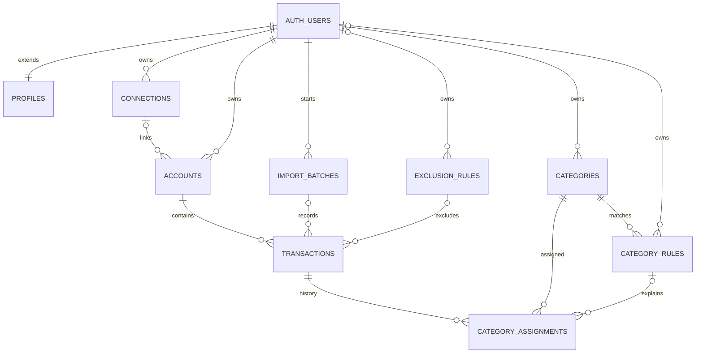

# Fintech ERM and Import Pipeline

## Entity Relationship



`CONNECTIONS` is the established table name for provider connections. It now
has a provider key, optional institution identifiers/name, metadata, and
provider-scoped uniqueness. Existing Tink rows keep the default `tink` value
and the one-Tink-connection-per-user behavior. Imported file accounts can
have a null `connection_id` because no bank/provider connection is implied by
the export.

## Tables and Keys

| Table | Responsibility and key ownership |
|---|---|
| `profiles` | Minimal one-to-one extension of `auth.users`; `id` is both PK and FK. Only timestamps are stored until a user-data export defines profile fields. |
| `connections` | Provider connection, owned by `user_id`; `(user_id, provider)` is unique. Institution fields are nullable until source metadata is available. |
| `accounts` | Existing internal UUID PK, owned by `user_id`; optional connection FK; `(user_id, source, source_account_id)` resolves imported accounts. Name/type may be null when the source does not provide them. |
| `import_batches` | User-owned import audit, keyed by UUID; `(user_id, source, checksum)` makes a source-file retry reuse the batch. Stores only the basename and SHA-256, never file contents. |
| `transactions` | Existing internal UUID PK and account FK; adds exact `amount_exact`, source IDs, descriptions, type/mutability, import link, timestamps, exclusion state, and private `raw_payload`. |
| `categories` | System categories have null `user_id`; custom categories reference `auth.users`. Names are case-insensitively unique within each ownership scope. |
| `category_rules` | One keyword per rule, with category FK, fields, match method, priority, and active timestamps. System rows have null owner; custom rows are user-owned. |
| `category_assignments` | Append-only manual/automatic/system assignment history. A partial unique index allows one active primary assignment per transaction. |
| `exclusion_rules` | Separate system or user-owned description exclusions, including fields, method, reason, and active timestamps. |

Foreign keys cascade when an auth user/account is deleted, set optional batch,
rule, or exclusion references to null when their audit parent is removed, and
restrict category deletion while assignments reference it. Composite
`(transaction_id, user_id)` ownership prevents assignments from crossing users.

The existing `transactions.amount` remains integer cents for compatibility
with the current application. `amount_exact NUMERIC` is authoritative and is
backfilled from those cents for existing rows. Import converts
`unscaledValue / 10^scale` using integer/string arithmetic only. The legacy
cents field is rounded using integer arithmetic; no floating-point value is
used or substituted for `amount_exact`.

Existing Tink provider transaction IDs are intentionally not unique: the
provider can renumber them during sync. Imports instead use
`(user_id, source, source_transaction_id)` for upserts and preserve
`provider_transaction_id` as a searchable source identifier. The importer
rejects duplicate source IDs and duplicate account/provider-ID pairs within
one input.

## Ownership and RLS

`auth.users.id` is the root owner. A database trigger creates `profiles` for
new auth users, and existing auth users are backfilled by the migration.
Accounts and transactions retain the existing direct `user_id` ownership and
parent-derived triggers. Every new table has RLS enabled in the migration.

Authenticated users can read their own profile, imports, accounts,
transactions, and assignment history. System categories/rules/exclusions are
readable to authenticated users; users can manage only their custom categories
and rules. The `raw_payload` column is omitted from authenticated column
privileges and is available only to trusted database/import contexts. Import
writes use the server-side CLI with a service-role key; that key is never used
in browser code or printed by the script. Manual assignments go through
`set_transaction_category`, which verifies `auth.uid()`, records history, and
updates the legacy category label. Direct browser updates to that label are
revoked.

The RLS integration check creates a second user and verifies profile and
custom-category isolation, own-row access, RPC authorization, and denial of
`raw_payload` reads. It requires a disposable local Supabase instance.

## Category Rules

`supabase/seed-data/transaction-categories.json` is the canonical mapping. It
contains 14 categories, 30 keywords, and 3 ignored test descriptions. The
generator creates `supabase/seeds/transaction-categories.sql`, and
`supabase/config.toml` applies that seed after the existing `seed.sql`.
Generation is deterministic and uses stable UUIDs plus upserts, so rerunning
the seed does not duplicate categories or rules.

Matching normalizes Unicode and compares case-insensitively against both
original and display descriptions. The dry run evaluates the canonical JSON;
apply mode also loads the selected user's active custom rules. Exclusions run
first. If no keyword hits,
the `Uncategorized` system category is assigned. Hits in multiple categories
are marked ambiguous and left without a category assignment; priority is not
used to conceal a conflict. Multiple matching keywords within one category
resolve deterministically to the longest keyword.

## Import Flow

1. Read a JSON array or an object containing `transactions` from the supplied
   external path. The raw file is never copied into the repository.
2. Validate required IDs, amount components, currency, status, descriptions,
   and dates. Invalid records are counted without logging record contents.
3. Hash the source bytes and create/reuse a user/source/checksum batch.
4. Resolve or create internal account rows by source account ID. Unknown name,
   type, provider, and institution values remain null rather than fabricated.
5. Apply exclusion rules, then match original and display descriptions.
6. Upsert each row by user/source/source transaction ID, store exact amount and
   original JSON payload, and persist excluded rows with their rule reference
   for audit rather than deleting them.
7. Replace prior automatic assignments, preserve active manual corrections,
   and write the final batch counts and status.

The pending-to-booked rule is intentionally conservative: a stable source
transaction identity updates the same row; `PENDING` may become `BOOKED`, but
`BOOKED` never regresses. If a source changes its transaction ID, the importer
does not guess a match from amount/date/description. This avoids merging
unrelated repeated transactions and is especially important because provider
IDs and transaction content can change. Such changed IDs need a future
provider-specific reconciliation key.

## Local Commands

```sh
npm ci
npm test
npm run check:category-seed
npm run generate:category-seed
supabase start
```

For a fresh disposable local database, `supabase db reset` applies migrations
and configured seeds, but it destroys the local Supabase database. The RLS
integration check can then be run with the local API URL and publishable key.
The import command defaults to dry-run:

```sh
npm run import:transactions -- <external-json-path>
```

Applying locally requires `--apply`, `SUPABASE_URL`,
`SUPABASE_SERVICE_ROLE_KEY`, and `SUPABASE_USER_ID`. Do not use a remote URL
unless its project and the remote operation have been explicitly approved.

## Expected Validation

For the supplied dataset, the expected summary is 3,534 received, 3 excluded,
3,531 accepted, and 2 accounts. The current mapping is expected to produce no
uncategorized legitimate records or multi-category conflicts. The private
transaction export was not available at its supplied local path during this
implementation, so those dataset-level counts have not been run here.

## Provisional Decisions

- `profiles` contains only its auth user ID and audit timestamps; profile
  attributes await the user-data export.
- Provider/institution details are not present in the available category
  mapping and were not invented. Generic imported accounts have null name,
  type, provider ID, and connection until reliable source metadata is supplied.
- The raw transaction export was unavailable, so exact field-path compatibility
  beyond the documented `amount.value`, `descriptions`, identifiers, account,
  date, status, type, and mutability shape remains to be confirmed against its
  schema without exposing its values.
- Exact amounts are preserved in `amount_exact`; the cents field is only a
  compatibility projection for existing app code.